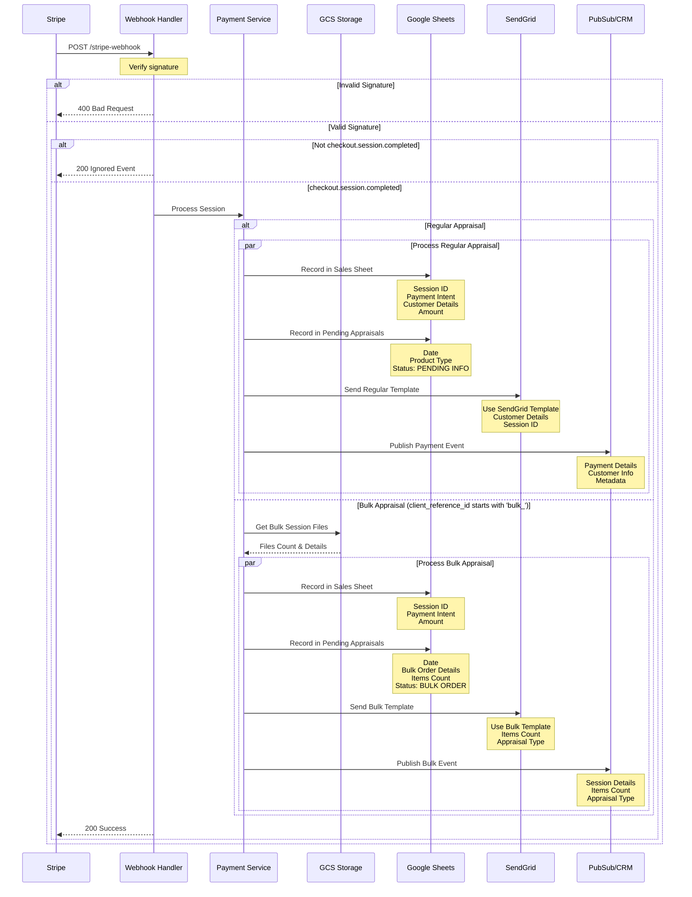

# Stripe Webhook Flow

## Flow Description

1. **Webhook Reception**
   - Stripe sends webhook event to `/stripe-webhook`
   - Signature is verified using webhook secret

2. **Event Processing**
   - Only processes `checkout.session.completed` events
   - Other events are acknowledged but ignored

3. **Session Type Detection**
   - Checks `client_reference_id` for "bulk_" prefix
   - Routes to appropriate processing flow

4. **Regular Appraisal Processing**
   - Records transaction in Sales spreadsheet
   - Creates pending appraisal entry
   - Sends regular confirmation email template
   - Notifies CRM system via PubSub

5. **Bulk Appraisal Processing**
   - Retrieves bulk session details from GCS
   - Records sale with bulk information
   - Creates pending appraisal with item count
   - Sends bulk confirmation email template
   - Publishes bulk event to CRM

6. **Data Storage**
   - Sales recorded in dedicated spreadsheet
   - Pending appraisals include order type and item count
   - Bulk sessions maintain file metadata in GCS
   - Customer information preserved

7. **Error Handling**
   - Invalid signatures return 400
   - Processing errors are logged
   - Stripe receives appropriate status codes